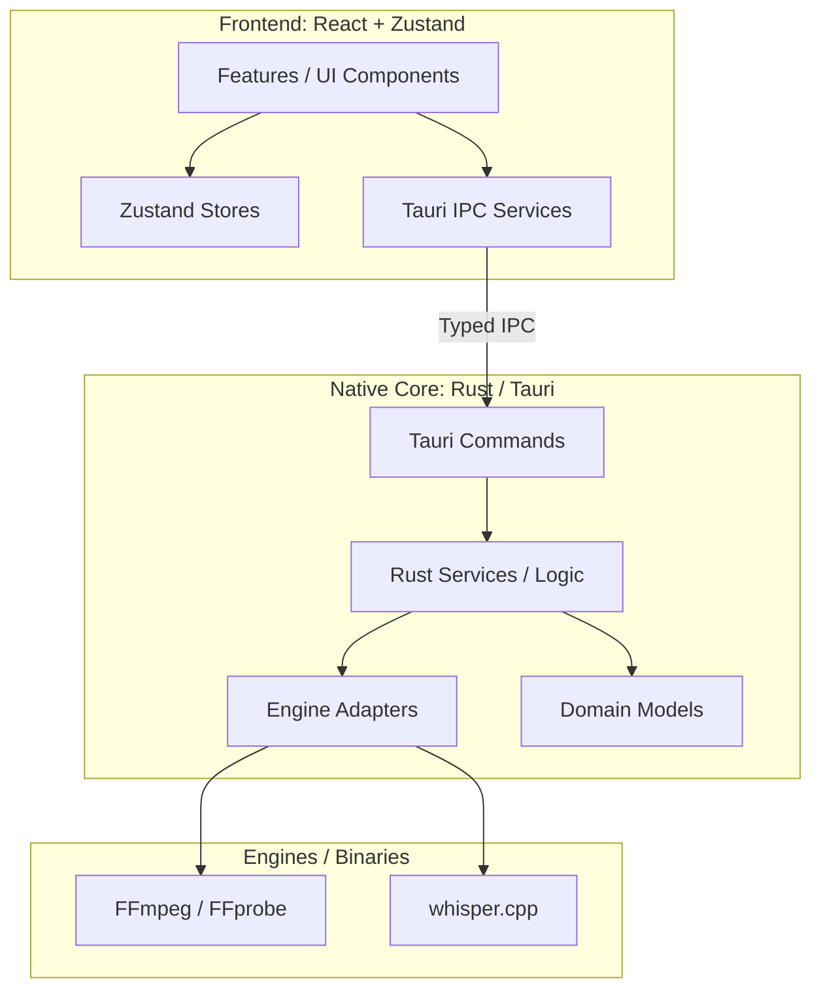

# Architecture Boundaries

Tài liệu này xác định ranh giới kiến trúc (boundaries), luồng dữ liệu (data flow) và quyền sở hữu module (ownership) của AI Auto Video Editor. Mục đích là ngăn chặn việc tạo ra các Controller/MainWindow nguyên khối và đảm bảo sự tách biệt (separation of concerns).

## 1. Dependency Map

Kiến trúc tuân theo luồng một chiều (One-way Data Flow) từ UI xuống tới Native Core.

## 2. Canonical Contracts (Domain Models)

Các model chuẩn (canonical) được chia sẻ giữa Frontend và Rust Core. Không truyền các object `any` hoặc cấu trúc tùy ý giữa các layer.

- **Project:** Cấu trúc JSON đại diện cho toàn bộ editing state. Lưu đường dẫn source media, version, settings.
- **Transcript & TranscriptSegment:** Kết quả của STT (whisper.cpp). Chứa `id`, `start`, `end`, `text`.
- **EditAction:** Thao tác chỉnh sửa nguyên tử (cut, mute, zoom). Bao gồm `type`, time range, `source` (local/ai/user), `enabled`.
- **EditPlan:** Danh sách các `EditAction` đã được validate. Đây là input duy nhất cho module Renderer/Preview.

## 3. Store Ownership

Frontend State được chia làm 3 loại rõ ràng:
1. **Persistent Project State (`useProjectStore`):** Lưu trữ nội dung của Project JSON (Transcript, EditPlan, Source Media). Đồng bộ với đĩa cứng.
2. **Ephemeral Playback State (`usePlaybackStore`):** Lưu trạng thái phát video hiện tại (currentTime, isPlaying, zoomLevel). Không được lưu vào đĩa.
3. **Job / Progress State (`useJobStore`):** Lưu trạng thái của các tiến trình dài (STT, Export, AI Analysis) như progress, status, error.

## 4. Frontend Feature Boundaries

Frontend được chia thành các folder theo tính năng độc lập trong `src/features/`. Cấm import chéo logic giữa các feature.

Các feature chính:
- `project`: Import, quản lý file, lưu/load project.
- `preview`: Video player, sync time, playback controls.
- `transcript`: Hiển thị text, chỉnh sửa text (non-destructive).
- `edit-plan`: Danh sách cut, timeline visual.
- `captions`: Cấu hình text overlay, style.
- `ai-review`: Nhận diện ngữ nghĩa, duyệt đề xuất AI.
- `export`: Tiến trình xuất MP4 cuối cùng.

**Quy tắc:** Nếu feature A cần giao tiếp với feature B, phải thông qua Zustand Store chung hoặc Tauri Event, không import component/hook của nhau.

## 5. Native Core Boundaries (Rust)

- **React chỉ gọi typed Tauri commands:** Không chạy trực tiếp process (`std::process::Command` trong frontend).
- **`src-tauri/src/commands/`:** Lớp mỏng nhất, chỉ làm nhiệm vụ parse tham số, gọi `services` và map Error thành kiểu trả về cho Frontend.
- **`src-tauri/src/services/`:** Nơi chứa business logic, orchestration (vd: quản lý file, điều phối workflow sinh transcript).
- **`src-tauri/src/engines/` (hoặc `adapters/`):** Bọc các lệnh thực tế tới OS hoặc binaries (FFmpeg, Whisper).

## 6. Ví dụ Placement (5 Use Cases)

| Use Case | UI / Feature (`src/features/`) | Store (`src/store/`) | Tauri Command (`src-tauri/src/commands/`) | Rust Service / Engine (`src-tauri/src/`) |
|---|---|---|---|---|
| **1. Import Video** | `project/ImportButton.tsx` | `useProjectStore` (set source) | `cmd_import_media` | `media_service::analyze` -> `ffprobe` |
| **2. Transcribe (STT)** | `transcript/TranscribeBtn.tsx` | `useJobStore` (progress), sau đó `useProjectStore` | `cmd_run_stt` | `stt_service::transcribe` -> `whisper_engine` |
| **3. Sinh AI Suggestion**| `ai-review/SuggestBtn.tsx` | `useJobStore` (progress) | `cmd_analyze_semantic`| `ai_service::analyze` -> (API Provider) |
| **4. Preview Edit** | `preview/VideoPlayer.tsx` | `usePlaybackStore` (time) | `cmd_generate_preview` (nếu render accurate) | `preview_service` -> `ffmpeg_engine` |
| **5. Export Video** | `export/ExportDialog.tsx` | `useJobStore` (progress) | `cmd_export_project` | `export_service::render` -> `ffmpeg_engine` |

## 7. Các Rule Cấm (Anti-patterns)

- **KHÔNG** để component UI tự tính toán đường dẫn file và gọi `Command.spawn("ffmpeg")` qua Tauri `shell` plugin.
- **KHÔNG** lưu API Key, Credentials vào LocalStorage hoặc Project JSON.
- **KHÔNG** tạo Circular Dependency (VD: Store A import Store B, Store B import Store A). Phải tạo Store C chứa logic chung hoặc dùng middleware.
- **KHÔNG** bypass `EditPlan`: Bất kỳ thao tác cắt/sửa nào cũng phải đẩy một `EditAction` vào `EditPlan`, sau đó Renderer mới đọc từ `EditPlan`.
